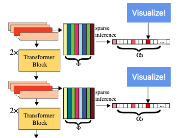

# Transformer visualization via dictionary learning

This repo contains the code for paper: [<em>Transformer visualization via dictionary learning: contextualized embedding as a linear superposition of transformer factors</em>](https://arxiv.org/abs/2103.15949) by Zeyu Yun*, Yubei Chen*, Bruno A Olshausen, and Yann LeCun ([DeeLIO Workshop](https://sites.google.com/view/deelio-ws/)@NAACL 2021).

## Demo



The Demo is here: [Demo](https://transformervis.github.io/transformervis/)

## Instruction

To visualize the hidden states for transformer factor. We need to first train a dictionary and then infer the sparse code using these dictionary.

To train a dictionary, 

```
run python train.py
```

If you want to use your own data, you need to put it in a python list, where each element is a string (sentences). Then save this list as a .npy file, then run

```
python train.py --training_data ./your_data.npy
```

To infer the sparse code and save the top activated examples for each transformer factors, run

```
python inference_efficient.py --dictionary_dir ./the_path_for_your_trained_dictionary
```

(Optional) To use LIME to generate the attribution (color) map, run 

```
python write_color.py --dictionary_dir ./the_path_for_your_trained_dictionary --example_dir ./the_path_of_your_top_activated_examples
```

## Citation

If you find this repo useful, please consider to cite our work:
```
@proceedings{Yun2021TransformerVis,
    title={Transformer visualization via dictionary learning: contextualized embedding as a linear superposition of transformer factors},
    author={Yun, Zeyu and Chen, Yubei and Olshausen, Bruno A and LeCun, Yann},
    booktitle = "Proceedings of Deep Learning Inside Out (DeeLIO) NAACL: The Second Workshop on Knowledge Extraction and Integration for Deep Learning Architectures",
    year = "2021",
    publisher = "Association for Computational Linguistics",
}
```


